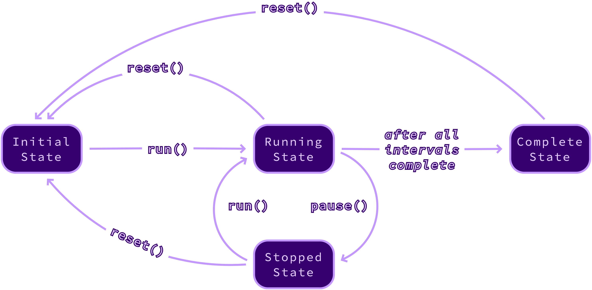

# Asyncio Timer

[](https://github.com/Kolyunya/aiotimer/actions/workflows/qa.yaml) [](https://sonarcloud.io/summary/new_code?id=Kolyunya_aiotimer) [](https://sonarcloud.io/summary/new_code?id=Kolyunya_aiotimer) [](https://codecov.io/github/Kolyunya/aiotimer)

An asynchronous timer with a human-friendly API and rich functionality.

* State management with `start()`, `stop()`, and `reset()` methods.
* On-the-fly adjustment of the duration with `set()`, `prolong()`, and `shorten()` methods.
* Introspection with `elapsed`, `remaining`, and `state` properties.
* Multi-interval configuration when a timer runs multiple times with a predefined schedule pattern.
* Looping capabilities for continuously running timers.
* Rich callback system enabling hooking into the timer lifecycle events.
* Synchronous and asynchronous callback modes.
* Concurrency-safe architecture designed to prevent race conditions and deadlocks.
* Support for a wide range of Python versions from `3.9` onward.
* Zero third-party dependencies.

## Table of contents
* [Basic usage](#basic-usage)
  * [One-off timer](#one-off-timer)
  * [Multi-interval timer](#multi-interval-timer)
  * [Other usage examples](#other-usage-examples)
* [States and transitions](#states-and-transitions)
* [Duration Factories](#duration-factories)
* [Event system](#event-system)
  * [Interval complete event](#interval-complete-event)
  * [Timer complete event](#timer-complete-event)
  * [Error event](#error-event)
* [Advanced usage](#advanced-usage)
  * [Sync and Async callbacks
](#sync-and-async-callbacks)
  * [Configuring precision](#configuring-precision) 
  * [Custom duration factories
  ](#custom-duration-factories)
* [Contributing](#contributing)

## Basic usage

### One-off timer

```python
from asyncio import run, sleep

from aiotimer import Timer
from aiotimer.duration import once


async def main() -> None:
  """
  Will run the timer for 3 seconds.
  Then will print a message.
  """

  timer = Timer(3, lambda: print('3 seconds passed'))
  await timer.start()

  # Wait for the timer to complete.
  await sleep(3 + 1)


if __name__ == '__main__':
  run(main())
```

### Multi-interval timer

```python
from asyncio import run, sleep

from aiotimer import MultiTimer
from aiotimer.duration import thrice


async def main() -> None:
  """
  Will run the timer three times for 1 second each.
  And will print intermediate messages every second.
  Then will print the final message after a total of 3 seconds.
  """

  timer = MultiTimer(
    thrice(1),
    on_timer_complete=lambda: print('3 seconds passed'),
    on_interval_complete=lambda: print('1 more second passed'),
  )
  await timer.start()

  # Wait for the timer to complete.
  await sleep(3 + 1)


if __name__ == '__main__':
  run(main())
```

### Other usage examples
More usage examples are available [here](examples).

## States and transitions
The timer class implements the [State Pattern](https://en.wikipedia.org/wiki/State_pattern). Methods that modify the timer state may only be called when the timer is in a supported state.

Any transition not listed in the diagram will raise an [`InvalidStateError`](sources/aiotimer/error/state_error.py). For example, you cannot `reset()` a timer while it is in the `InitialState`, and you cannot `run()` a timer that is in the `CompleteState`.

This design is used as a defensive programming technique that helps catch any logic errors in the code early and simplifies the debugging process.



## Duration Factories
[`Duration Factories`](sources/aiotimer/interval/factory) are responsible for generating durations for [`Multi Timers`](sources/aiotimer/multi_timer.py).  There are many built-in duration factories that should cover the majority of common use cases.

```python
from aiotimer.duration import *

# Generates 1 interval of 5 seconds.
once(5)


# Generates 2 intervals of 5 seconds each.
twice(5)


# Generates 3 intervals of 5 seconds each.
thrice(5)


# Generates 1 interval between 5 and 10 seconds.
randomly(5, 10)


# Generates 3 intervals of 1, 2, and 3 seconds.
sequentially(1, 2, 3)


# Generates 5 intervals of: 1, 2, 4, 8, and 16 seconds (powers of 2).
exponentially(2, interval_count=5)


# Generates 5 intervals of: 1, 2, 4, 8, and 16 seconds (powers of 2).
exponentially(2, maximum_duration=16)


# Generates 30 intervals of 1, 2, 3, 1, 2, 3, ... seconds.
# Any IGF may be passed as the first argument.
repeatedly(sequentially(1, 2, 3), 10)


# Generates an infinite number of intervals of 1, 2, 3, 1, 2, 3, ... seconds.
# Any IGF may be passed as the first argument.
forever(sequentially(1, 2, 3))


# Generates 3 intervals of 5±0.5 seconds (10% relative jitter).
# Any IGF may be passed as the first argument.
jittery(thrice(5), relative=0.1)


# Generates 3 intervals of 5±0.5 seconds (0.5 second absolute jitter).
# Any IGF may be passed as the first argument.
jittery(thrice(5), absolute=0.5)


# Generates 4 intervals of 0, 5, 5, and 5 seconds.
# Any IGF may be passed as the first argument.
immediately_then(thrice(5))


# Generates no intervals.
# Used in the test suite for testing edge cases. 
never()
```

> If you believe some type of duration factory is missing, feel free to submit an issue or a pull request.

## Event system
All event handlers **must** comply with the following API contract. Non-compliant event handlers result in undefined behavior.
* Event handler **must** have either:
    * Zero parameters.
    * Exactly one positional parameter accepting the corresponding event object type.
* An event handler's signature **must not** be modified at runtime after registration with the timer object.
* Event handler **should not** return any values because they will be ignored and discarded by the timer.
* Event handler **may** be either:
  * Synchronous callable.
  * Asynchronous callable.

> All event objects have a `timer` property that references the timer object that fired the event.

> Any public method of a timer object may be safely called from any event handler. The internal timer architecture prevents any race conditions and deadlocks from occurring. 

### Timer complete event
This event is fired each time the last interval of a timer is complete. An `on_timer_complete` handler **_may_** optionally accept a [`TimerCompleteEvent`](sources/aiotimer/event/timer_complete_event.py) object. Events of this type have the following properties:
* `timer: Timer|MultiTimer`
* `interval_count: int`

### Interval complete event
This event is fired each time any interval of a timer is complete. An `on_interval_complete` handler **_may_** optionally accept an [`IntervalCompleteEvent`](sources/aiotimer/event/interval_complete_event.py) object. Events of this type have the following properties:
* `timer: MultiTimer`
* `interval_number: int`
* `interval_duration: float`

### Error event
This event is fired each time any exception is propagated from any of the event handlers described above. Additionally, it is fired when an exception occurs inside a system coroutine of a timer. An `on_error` handler **_may_** optionally accept an [`ErrorEvent`](sources/aiotimer/event/error_event.py) object. Events of this type have the following properties:
* `timer: Timer|MultiTimer`
* `error: Exception`

## Advanced usage

### Sync and Async callbacks
Use the `await_callbacks` parameter of the `MultiTimer` constructor to control the way the callbacks are handled.

In the sync mode (`await_callbacks == True`) the next interval would not start until the `on_interval_complete` callback finishes execution.

In the async mode (`await_callbacks == False`) the next interval would start immediately after the previous one completes.

> Both modes support `def`, `async def` as well as any other types of [compatible callables](#event-system). It's perfectly fine to use `def` in the async mode and `async def` in sync mode.

### Configuring precision
The timer class has a configurable `precision: float` parameter. It represents the amount of seconds a timer would idle between its system ticks.

For adequate accuracy, it is recommended to have the precision value configured significantly (at least several times) smaller than the shortest interval the timer would have.

At the same time, having the precision configured to an extremely low value (e.g. `0.001`) may yield a high CPU load.

### Custom duration factories
Creating a custom duration factory is pretty straightforward. It is basically a callable that returns an `Iterable[float]` object.

> This design is required to support the following features.
> * Perpetually running `MultiTimer` which requires an infinite `Generator` for durations.
> * The `reset()` method which requires a new instance of the duration `Generator`.
>
> A factory allows timer to create a new instance of a duration generator after a reset.

```python
from asyncio import run, sleep

from aiotimer import MultiTimer
from aiotimer.event import IntervalCompleteEvent, TimerCompleteEvent


async def main() -> None:
    duration_factory = lambda: [1, 2, 3]

    def on_timer_complete() -> None:
        print(f'Timer complete after 6 seconds')

    timer = MultiTimer(
        duration_factory,
        on_timer_complete,
    )
    await timer.start()

    # Wait for the timer to complete.
    await sleep(6 + 0.1)


if __name__ == '__main__':
  run(main())
```

## Contributing

### Configuring the development environment
```bash
# Create and activate a virtual environment.
python -m venv .
source bin/activate

# Install the library and its dependencies.
pip install --upgrade pip
pip install --editable ".[development]"

# Run the test suite.
BEARTYPE=Yes python -m test --skip-slow=No
```

Additionally, convenient `Quick QA` and `Full QA` run configuration are provided for `PyCharm` users.
